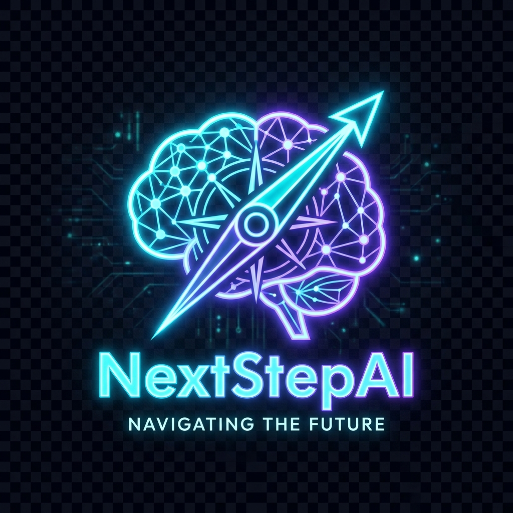
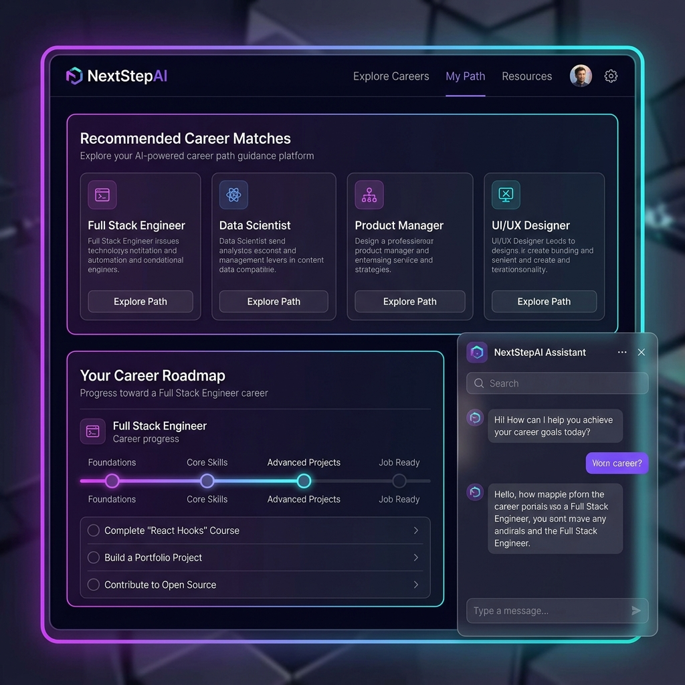
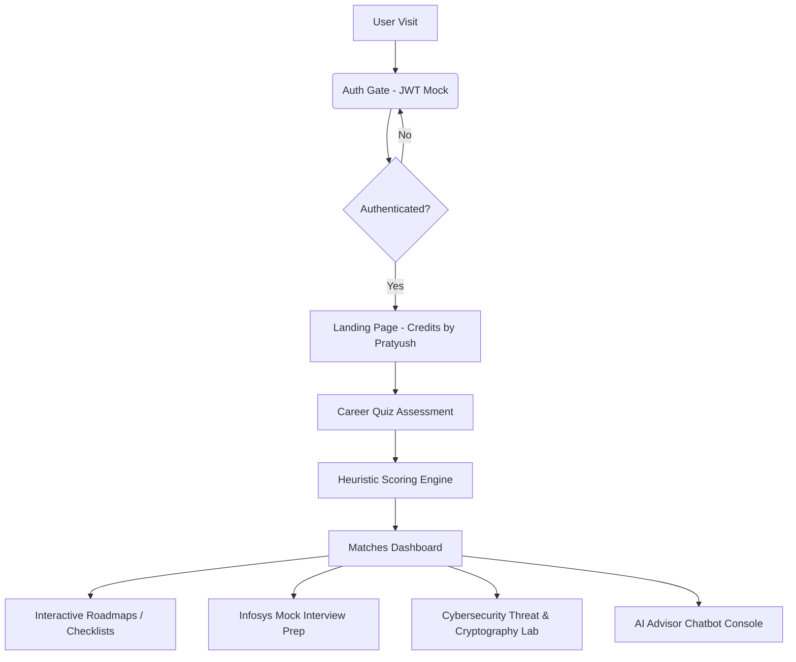

# NextStepAI — AI-Powered Career Guidance & Path Planner

<p align="center">
  
</p>

<h3 align="center">NextStepAI</h3>
<p align="center">
  <strong>An Enterprise-Grade Career Guidance, Technical Interview Prep & Cybersecurity Auditing Console</strong>
</p>

<p align="center">
  
  
  
  
  
</p>

<p align="center">
  <a href="https://nextstepai-pratyush.vercel.app/" target="_blank">
    
  </a>
  <a href="https://pratyushpandey31.github.io/AI-PATH-FINDER/" target="_blank">
    
  </a>
</p>

---

## 👤 Lead Developer
*   **Name**: **Pratyush Pandey**
*   **Specialization**: **Full-Stack Software Engineer & Cybersecurity Auditor**
*   **Target Roles**: Systems Engineer / Specialist Programmer / Digital Specialist Engineer (Infosys)

---

## 📸 Interface Preview
Below is a high-fidelity visual mockup of the NextStepAI dashboard interface showing match lists, interactive roadmap timelines, and the counselor chatbot:

<p align="center">
  
</p>

---

## 🌐 Live Deployments
*   **Vercel Production Domain**: [https://nextstepai-pratyush.vercel.app/](https://nextstepai-pratyush.vercel.app/)
*   **GitHub Pages Domain**: [https://pratyushpandey31.github.io/AI-PATH-FINDER/](https://pratyushpandey31.github.io/AI-PATH-FINDER/)

---

## 🎯 Project Overview & Mission

**NextStepAI** is a futuristic, highly responsive single-page web application designed to eliminate career choice ambiguity. It targets the core issue of millions of students selecting careers without structured, personalized guidance. 

By integrating **skill mapping, interest profiling, interactive roadmaps, dynamic salary trends (localized to INR/LPA), customized interview simulators, and real-time cybersecurity audits**, NextStepAI stands out as an elite, production-ready portfolio project showcasing end-to-end frontend expertise and domain security knowledge.

---

## 🚀 Key Features

*   **🔑 Secure Session Authentication Portal**: Protects all paths with a glassmorphic Login/Register gate. Validates credentials and mounts a secure JWT-mockup session, preserving user profiles dynamically in LocalStorage.
*   **📊 Talent & Interests Profiling Quiz**: An interactive, 3-step assessment tracking cognitive preferences, technical competencies, and workplace environments to score career matches.
*   **🎯 Adaptive Heuristic Recommendation Engine**: Matches user responses against a multidimensional career database, calculating precise similarity quotients.
*   **🗺️ Interactive Education Roadmaps**: Generates step-by-step career timelines complete with interactive check-boxes and vetted learning portals. Saves roadmap checklists persistently.
*   **📈 SVG Salary & Market Demand Visualizer**: Renders custom-coded, animated SVG graphs displaying 5-year salary growth projections **in Indian Rupees (INR) Lakhs Per Annum (LPA)**.
*   **🎓 Technical Interview Simulator (Infosys Prep)**: Calibrates challenging mock interview questions for your selected career. Scores answers out of 10, highlights keyword hits/gaps, and details senior-engineer model responses.
*   **🛡️ Cybersecurity Threat & Cryptography Lab**: A dedicated auditor dashboard containing:
    - *HTTP Header & SSL Auditor*: Scans raw response headers for missing security guards (CSP, HSTS, X-Frame-Options, X-Content-Type-Options) with risk levels and Express configurations.
    - *Password Entropy & Hash Lab*: Calculates Shannon Entropy bits, estimates Botnet crack durations, and computes client-side **SHA-256** digests via browser Web Crypto APIs.
*   **💬 Contextual AI Counselor Chatbot**: Simulates a dedicated mentor, pre-feeding quiz data to answers questions about certifications, portfolios, and transitions.

---

## 📊 Application Architecture & Flow

The following Mermaid diagram maps the layout routing and secure state-synchronization pathways inside the app:



---

## 🛠️ Technical Stack

*   **Frontend Core**: React (v19)
*   **Build Environment**: Vite (v8) — delivers rapid HMR configurations and optimized compilations.
*   **Styling Architecture**: Custom CSS variables, responsive grids, and hardware-accelerated animations. 100% clean Vanilla CSS.
*   **Security & Encryption APIs**: Web Crypto API (SubtleCrypto)
*   **Icons Framework**: Lucide React
*   **Data Models**: Structured JSON schemas for careers data and interview sheets.

---

## 💻 Installation & Local Deployment

Ensure you have [Node.js](https://nodejs.org/) installed (v18 or higher).

### 1. Clone the Repository
```bash
git clone https://github.com/PratyushPandey31/AI-PATH-FINDER.git
cd AI-PATH-FINDER
```

### 2. Install Project Dependencies
```bash
npm install
```

### 3. Run Development Server
```bash
npm run dev
```
Open [http://localhost:5173](http://localhost:5173) in your browser.

### 4. Build Production Bundle
To compile and compress the assets:
```bash
npm run build
```

---

## 💼 Core Design Patterns & highlights (Infosys Interview Ready)

1.  **State Synchronization**: React hooks propagate the profile states. For instance, completing the quiz automatically updates the counselor's knowledge base and matches the interview simulator's default focus.
2.  **Low-Weight Visualizations**: Renders salary graphs natively using raw SVG templates and responsive CSS classes, avoiding high-weight visualization packages and maximizing page loading performance.
3.  **Local Storage Persistence**: Save user logins and roadmap checks persistently to ensure that progress is preserved upon browser refreshes.
4.  **Hardware Cryptography**: Avoids external hashing packages by calling the browser's native subtle cryptographical APIs for secure, sandbox-compliant SHA-256 calculation.

---

## 📄 License

This project is licensed under the MIT License. See the `LICENSE` file for details.
